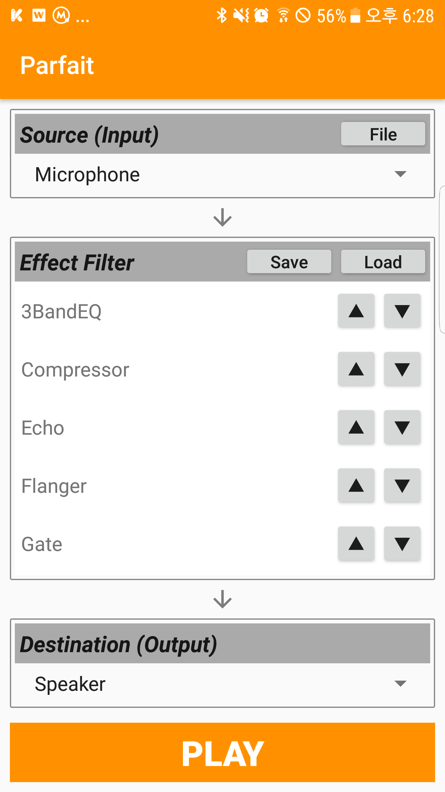
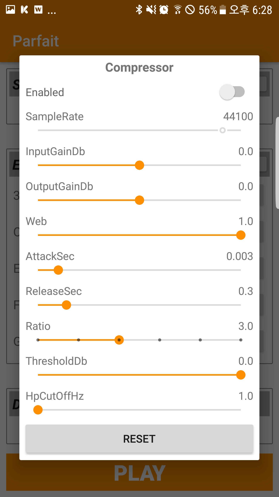

# Parfait

Sound Effect Library (DSP)

## Support

 * Platform: Android,iOS, OSX
 * Source: PCM Raw data
 * Processing: Real-time, Non Real-time
 * Number of Channels: 1-2 channels
 * BitPerSample: 16-bit Only
  
## Notice
 * Parfait 에서 제공하는 Engine 코드는 src 폴더에 있습니다.
 * 나머지 파일들은 샘플코드이거나 불필요한 코드이므로, 사용하지 마시고 참고만 하세요.

## Usage

```c++
using namespace parfait;

unsigned int sampleRate = 44100;
LivePcmConverter * converter = LivePcmConverter::FromJson(json, sampleRate);
converter->SetEnabled(true);	// Don't forget!
converter->CleanUp();         // clean up buffers

// Processing
short * inputBuffer[1024];  // size must be a power of 16 !!!!!!!!!!!!!!!!!!!!!!!!!!!
int readSize = 1024;
while([EOF]) {	// Read data from audio file
  short *output = converter->Process(inputBuffer, readSize, [NUMBER_OF_CHANNELS]);
  if(output == NULL) {} // Fail!!
  
  // write result to file
  if(readSize > 0) {
    write_to_file(output, readSize);
  }
  
  free output;  // DONT FORGET!!
}
 
converter->CleanUp();
converter->SetEnabled(false);
delete converter;
```

## Comments
* json 은 제공되는 Parfait 의 Preset 데이터로서, 파일을 읽은 뒤 const char * 형태로 넘기시면 됩니다.
* LivePcmConverter::SetEnabled(true) 를 해야만 변환이 됩니다.
* LivePcmConverter::Process(short int *inputData, unsigned int &sizeInShort, unsigned short numberOfChannels) 형식입니다.
* inputData(변환할 PCM 데이터), sizeInShort(변환할 PCM 데이터 크기), numberOfChannels(변환할 PCM 데이터의 채널 수)
* 변환에 따라 input 과 output 의 size 는 동일하지 않을 수 있습니다.
* output 은 사용후 caller 에서 free 해 주어야 합니다.
* 변환된 output 의 size 는 Process 의 두번째 파라미터로 반환됩니다.
* 내부적으로 음성변조시 FFT 를 사용합니다. 따라서 입력 Buffer 의 크기는 16의 배수여야 합니다.
* FFT 윈도우 사이즈가 2048 임을 감안하면, 1024 이상을 권장합니다.


## Samples
#### Android
 * [Preset Editor] : 사운드팀 Preset 생성용 [Download]
  
 
 * [Simple Usage] : 실시간 변환 [Download]
 * SimpleUsage 앱의 경우, 안드로이드 6.0 이상은 설정에서 '권한설정'을 직접 해 주세요.

#### iOS
 * 


## Wiki
 * [Parfait]


## Release Note
### Ver 0.1
* Harmonic Effect 추가 (2017-01-23)
* Gain Effect 의 변경단위 dB 로 수정 (2017-01-16)
* Process 도중에 간혹 Crash 발생하는 이슈 수정 (2017-01-12)

## History Note
### 2017-03-06
* LivePcmConverter->CleanUp() 추가 : 음성변조 시작전에 호출하세요.
